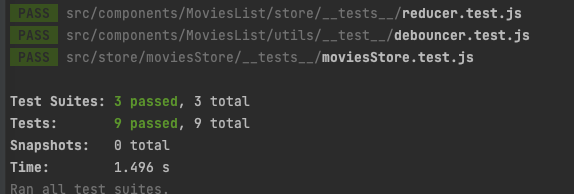
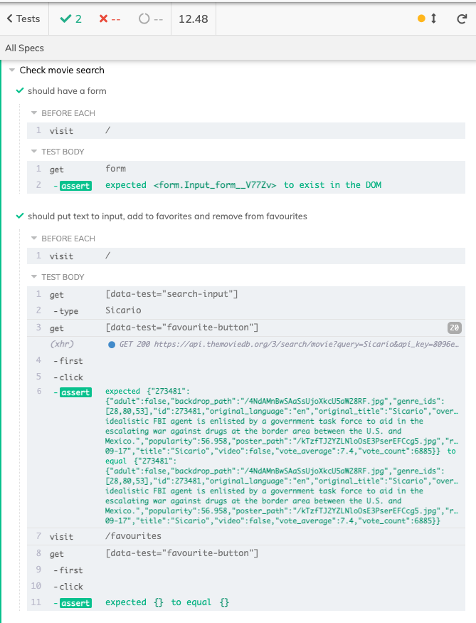

## Deployment URL

Deployment URL is: [https://movies-arozanov.vercel.app](https://movies-arozanov.vercel.app)

## Coding problem
* A search field and like a table for showing the result.
* It should also have functionality for setting movies as your favourites, maybe with a star
symbol in the table.
* A list where you can add movies you want to watch, like the “watch later” functionality on
YouTube.
* Make Sure to test the application and write the tests in the Repo.
* The App Must Be working on desktop as well as mobile.
* Posters and trailers are always nice, this is however up to you.(Optional)
* Last but definitely NOT least, please include a Demo for us to see.

## Assumptions and limitations:
1. Not using any state manager, React vanilla only with custom hook using useReducer.
2. Input search field debounce and cancel previous requests.
3. Movies added to Favourites and Watch Later lists are stored in localstorage with cached in memory. 
4. Responsive till 320px width.
5. ErrorBoundary, React Suspense and React Router 6 used.
6. Deployed on Vercel.

## How to build and run

First, you will need API key for [https://themoviedb.org](https://themoviedb.org).
Then. clone the project, create file `.env.local` in the root and fill it out with:

`
REACT_APP_MOVIES_HOST=https://api.themoviedb.org
REACT_APP_MOVIES_HOST_URL=/3/search/movie
REACT_APP_POSTER_URL=https://www.themoviedb.org/t/p/w220_and_h330_face
REACT_APP_API_KEY=********HERE YOUR API KEY********
`

then just run 

`yarn` 

and 

`yarn start`

## How to test

For Unit-tests just run 

`yarn test`

For E2E tests install Cypress for your platform, and run

`npx cypress open`

and click on `Run integration tests`

